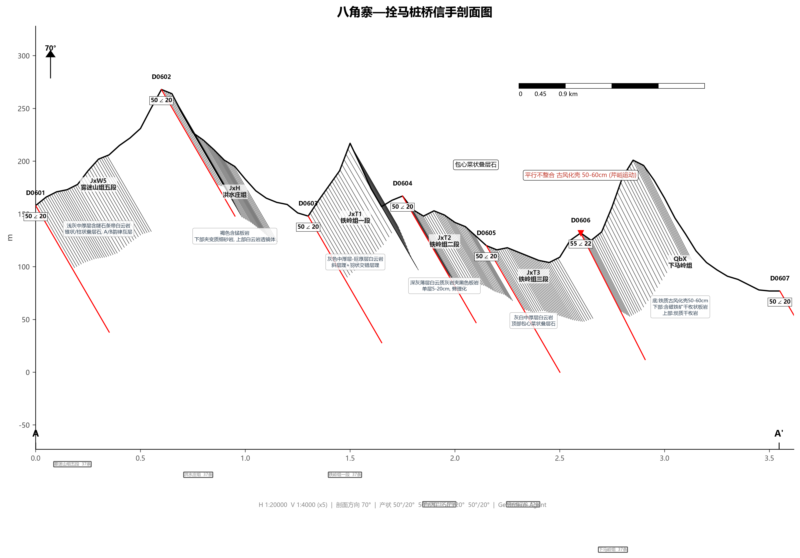
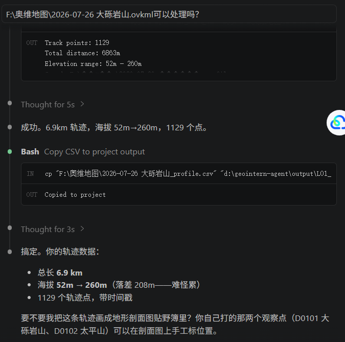
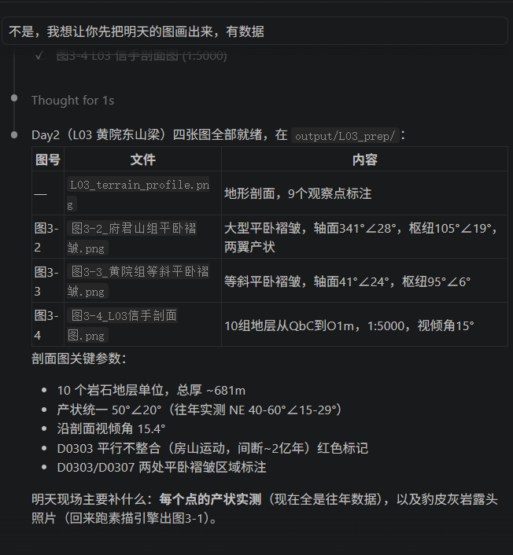
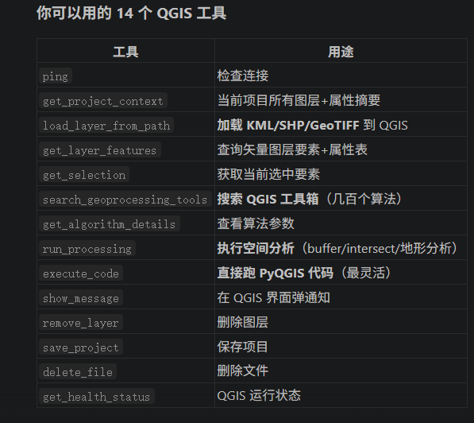
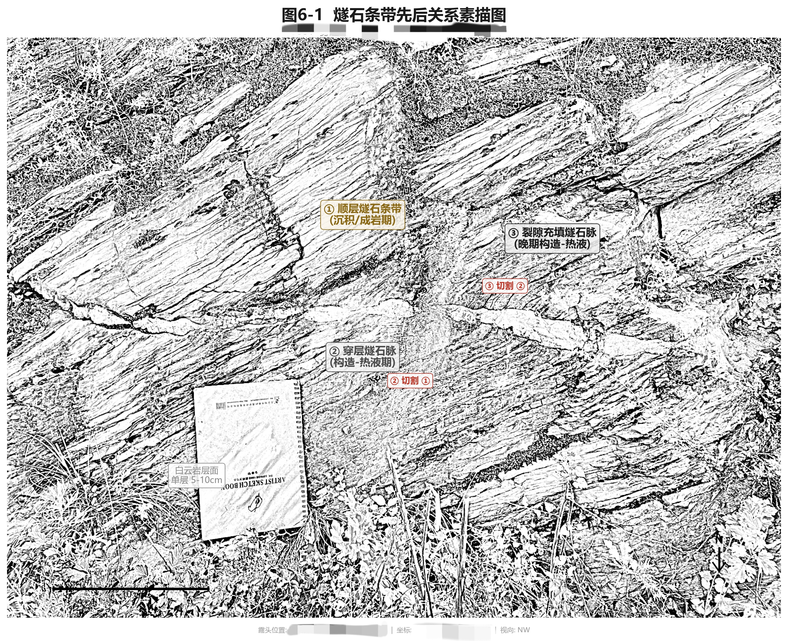
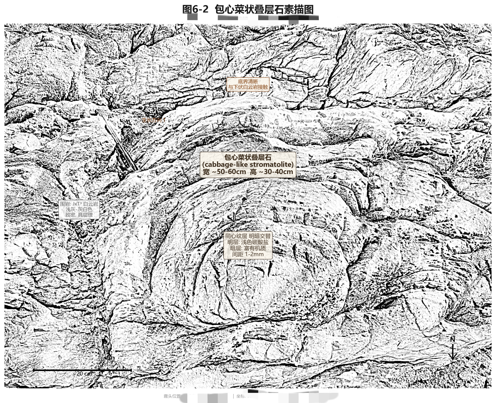
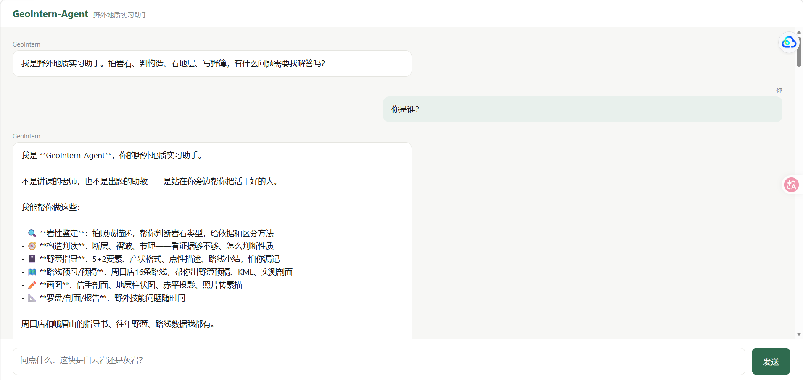
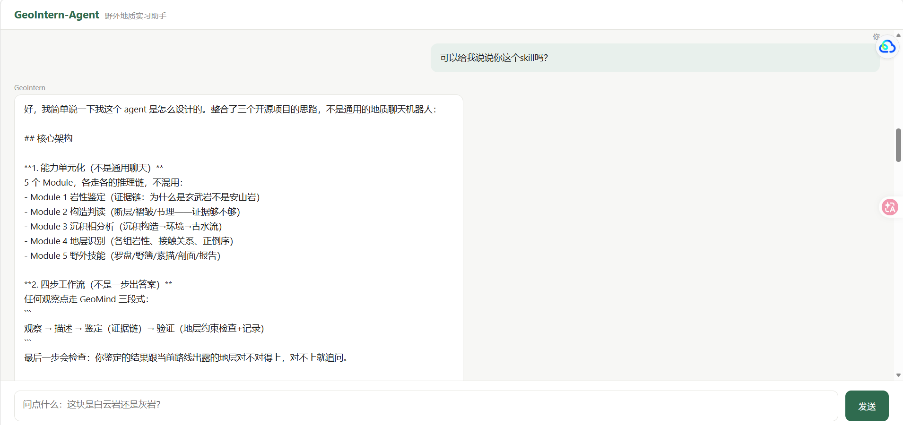
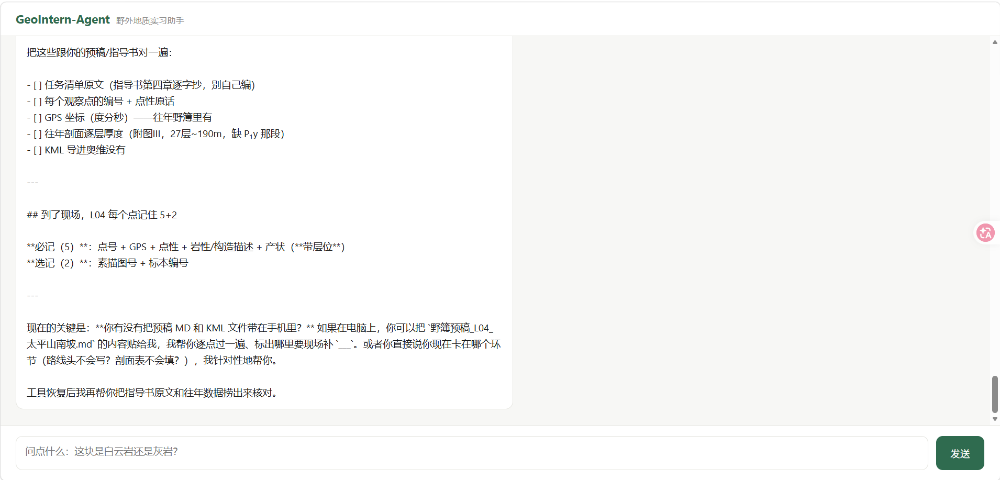

# GeoIntern-Agent

野外地质实习的 AI 助手 —— 岩石鉴定、构造判读、沉积相分析、地层识别，把重复活交给 AI。

> **定位**：AI + GIS + 野外地质 的交叉项目。作者是地质专业学生、自学 AI，项目最初为野外实习而做，现整理开源。

## 设计理念

**不是通用聊天，是专门任务链。** 岩石鉴定和构造判读走不同的推理链，能力之间不互扰。

吸收三个开源项目的架构思路：

| 来源 | 核心洞察 | 落地 |
|------|---------|------|
| GeoSquire | 不做通用聊天，做专门任务链 | 5 个 Module 各自独立推理链 |
| GeoGPT | 地学文本不能靠通用 embedding | 按路线+观察点预切分，精确匹配优先 |
| GeoMind | 鉴定不是一步出答案，拆成三段 | 观察→描述→鉴定→约束验证四步工作流 |

## 它能干什么

- **拍照鉴岩**：拍张岩石照片，AI 描述岩性、猜类型、给判断依据（Qwen-VL）。手机也能用，拍照直接上传识别
- **剖面 / 柱状图出图**：给地层数据，自动出标准信手剖面、柱状图、赤平投影
- **照片转地质素描**：露头照片 → 铅笔风素描线稿（OpenCV 边缘检测 + VTracer 矢量化）
- **地学 RAG 问答**：按路线 + 观察点切分的地学知识库，回答必须引用出处
- **路线可视化**：KML 轨迹 + 观察点铺到交互地图，带 3D 地形

## 截图预览

**信手剖面出图** — 周口店八角寨—拴马桩桥



**KML 轨迹 → 地形剖面**



**野外构造分析** — 黄院东山梁



**QGIS 工具集成**



**露头识图** — 燧石条带白云岩



**地质素描** — 包心菜状叠层石



**对话问答** — Web Demo 实操（手机也能用，支持上传图片识别）





> 完整 11 张实操截图见 [`docs/images/chat/`](docs/images/chat/)

## 核心能力

### 多模块任务链

| 模块 | 功能 |
|------|------|
| 岩石鉴定 | 手标本描述 → 矿物组成 → 岩石定名 → 成因推断 |
| 构造判读 | 断层/褶皱/节理识别 → 应力场分析 → 构造序列 |
| 沉积相分析 | 岩性组合 → 沉积构造 → 相标志 → 沉积环境 |
| 地层识别 | 岩石地层单位 → 生物地层 → 接触关系 |
| 数据记录 | GPS/产状/厚度/岩性 → 野簿格式 → 信手剖面 |

### 地学 RAG 检索

- 教材和指导书按路线+观察点预切分（非通用 chunking）
- 优先精确匹配（地层名、构造名），fallback 语义检索
- 回答必须引用出处（指导书第X页/路线X观察点X）

### 四步推理工作流

```
Step 1 观察 → Step 2 描述 → Step 3 鉴定（证据链）→ Step 4 自检
```

Step 4 做约束交叉验证——鉴定结果与相邻观察点的已知地层约束校验，不一致时追问确认。

### 安全规则引擎

自动识别悬崖/陡坡/溶洞等危险场景，优先提醒安全再谈地质。

## 目录结构

```
geointern-agent/
├── web/            # demo 入口：FastAPI 对话 + RAG + 识图
├── webmap/         # 路线可视化地图（静态，可挂 GitHub Pages）
├── references/     # 领域知识库（岩石/构造/沉积/地层的决策树 + 野外技能）
├── core/           # 可复用引擎（出图 + 素描 + 视觉 + KML 工具）
├── examples/       # 一次性脚本当示例（各路线剖面、点位素描、转录清洗）
└── output/         # 出图结果（demo 图）
```

## 快速开始

### 1. Web demo（对话 + 识图）

```bash
cd web
pip install -r requirements.txt
cp .env.example .env        # 填上你的 key
python app.py               # 默认 0.0.0.0:8000
```

`.env` 需要两个 key：

```env
DEEPSEEK_API_KEY=sk-你的key          # 对话（默认 deepseek-v4-pro）
DASHSCOPE_API_KEY=sk-你的key         # 识图（qwen-vl-max）
```

### 2. 路线地图（webmap）

```bash
cd webmap
python -m http.server 8000
# 浏览器打开 http://localhost:8000
```

> 不能直接双击 index.html（file:// 会拦本地 JSON），务必走静态服务器。

### 3. 出图引擎（core）

```bash
# 依赖 numpy / matplotlib，先装
python examples/cross_section_L04.py   # 示例：L04 路线信手剖面
```

`examples/` 里的脚本已注入 `core/` 到 sys.path，直接跑即可。

## 技术栈

- **后端**：Python · FastAPI
- **AI**：DeepSeek（对话/流式）· Qwen-VL（多模态识图）
- **RAG**：地学感知切分 + TF-IDF 语义检索（scikit-learn）
- **GIS/制图**：matplotlib · KML/GeoJSON · Leaflet · Playwright MCP
- **图像**：OpenCV · VTracer

## 愿景：从"野外助手"到"全国地质填图平台"

当前 GeoIntern-Agent 是一个随身 AI 助手，解决现场的"看什么、记什么、怎么写"。

长期目标：把整个地质勘探区的数据集成到一个三维可视化平台上——类似《死亡搁浅》的任务系统：

```
底层：全国 DEM + 地质图，3D 地形漫游
中层：路线规划 + 观察点空间管理 + 实测数据云端同步
上层：GeoIntern-Agent 现场 AI（已完成 MVP）
出图：剖面/柱状/赤平/素描一键生成（已完成部分）
```

**最终形态**：打开浏览器，拖动三维地形，点击"xx地 xx山向斜"——系统规划最优剖面路线 → 出发前打印预稿 → 现场开 Agent 辅助 → 回来实测数据自动填入 → 模型更新 → 报告生成。

**时间线**：
- **2026**：走 L1，定 5 个点，画剖面，传 GPS+照片+产状
- **2027**：打开平台，L1 已经亮了——沿着 26 年的轨迹走，但不用从头找点，只需验证+修正+补漏。提交后，xx地 xx山向斜三维模型精度提升
- **十年后**：地质勘探区所有路线的每个观察点都经过 5-10 年勘探人员验证，精度超过任何单个地质队的填图

做的不是"作业"，是**众包地质填图**。

## 现状与诚实说明

这个项目是从一整个暑假的野外实习里长出来的，不是从零设计的商业产品。有些地方还没收拾干净：

- `examples/` 里很多脚本是「某条路线的一次性成品」，不一定开箱即用，需要按具体数据调
- 知识库（`references/`）目前以周口店、峨眉山两条实习路线为主，没覆盖其他地区
- 依赖清单还没收敛成一个统一的 `requirements.txt`（`core/` 引擎的依赖没列全）

如果你也是地质相关专业、或者在做地质信息化，欢迎提 issue 聊聊——尤其是「你们野外最想甩掉的重复活是什么」。

## License

[TODO：还没定，MIT / GPL / 其他待选]
